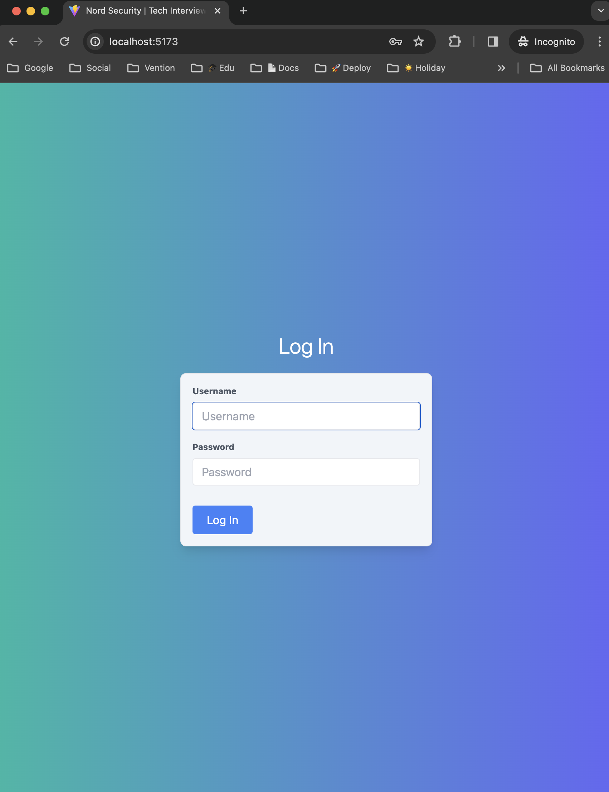
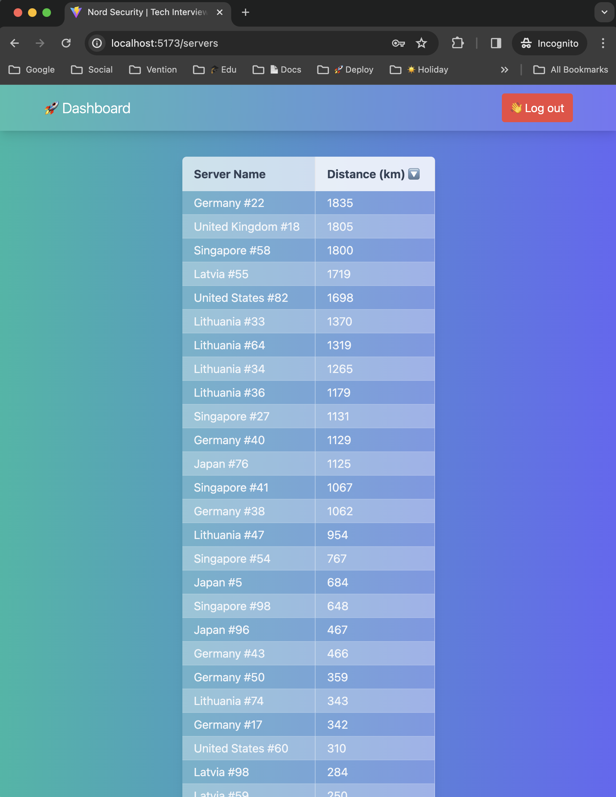

## Possible Refactoring

While developing this app within a limited timeframe, some optimizations were made. However, there are additional improvements that could be considered:

- Restructure the server table and filtering to accommodate potential changes to the Server entity, such as adding more fields.
- For future forms, it may be beneficial to incorporate a more robust form management and validation library. One recommended option is react-hook-form combined with ZOD, especially when working with TypeScript.

## Login Credentials

- username: tesonet
- pass: partyanimal

## Live Application View

[🧑‍💻 Preview Live Application Here](https://kastaselis.github.io/nord-security-server-dashboard/)

## Important Commands

- `npm run dev` will run the development server.
- `npm run build` runs the build script.
- `npm run test` will run the unit & integration test suite.
- `npm run test:coverage` runs the unit & integration test suite and generates a coverage report.

## Application Screenshots

    
    

